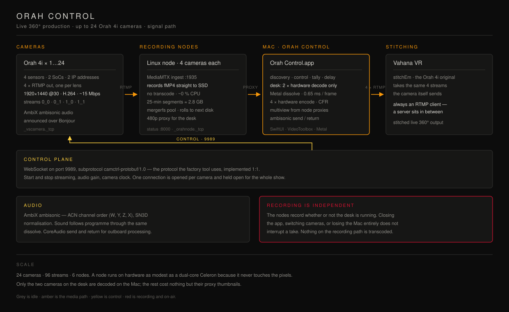

# Camorah — Orah 4i Control System

> Fork of [nicognaW/camorah](https://github.com/nicognaW/camorah) — extended with a full Mac control app, multi-node recording infrastructure, OBS switching, and MIDI support.



---

## What changed from the original

| | Original | This fork |
|---|---|---|
| Camera discovery | ✅ Zeroconf | ✅ same |
| Start/stop streaming | ✅ CLI | ✅ GUI + CLI |
| UI | ❌ none | ✅ Mac desktop app |
| Recording | ❌ none | ✅ FFmpeg streamcopy on Intel nodes |
| OBS switching | ❌ none | ✅ 4× OBS via WebSocket |
| MIDI control | ❌ none | ✅ any MIDI device |
| Multi-node | ❌ none | ✅ scalable Intel PC array |
| Camera count | fixed | ✅ dynamic (1 to N) |

---

## Key design principle

Recording and live switching are **completely independent**:

- `FFmpeg` records from the moment cameras start — zero dependency on OBS
- `OBS` switches scenes only when the operator selects a camera (UI click or MIDI)
- If OBS crashes, recording continues uninterrupted
- `streamcopy` = no transcoding, 0% CPU load

---

## Files

```
mac/
  ui.py                           Mac desktop app (CustomTkinter)
  controller.py                   backend: discovery, OBS, HTTP calls
  midi_controller.py              MIDI pult listener
  generate_mediamtx_config.py     generates mediamtx.yml dynamically
  config.json                     node IPs, OBS ports (edit this)

intel/
  agent.py                        FastAPI recording agent (Linux/Windows)

architecture.svg                  system diagram
```

---

## Quick start

**Mac M4**
```bash
pip install customtkinter httpx obsws-python mido python-rtmidi zeroconf
python mac/generate_mediamtx_config.py
./mediamtx mac/mediamtx.yml
python mac/ui.py
```

**Intel node**
```bash
pip install fastapi uvicorn httpx
python intel/agent.py --node-id 1 --cameras 1,2,3,4,5,6 --mac-ip 192.168.1.10 --record-dir /mnt/recordings
```

---

## Network ports

| Port | Device | Purpose |
|------|--------|---------|
| 1935 | Mac M4 | RTMP ingest (MediaMTX) |
| 9997 | Mac M4 | MediaMTX REST API |
| 4455–4458 | Mac M4 | OBS WebSocket |
| 8000 | Intel PC | Recording agent API |

---

## License

Original: WTFPL — see [LICENSE](LICENSE). Extensions: same.
