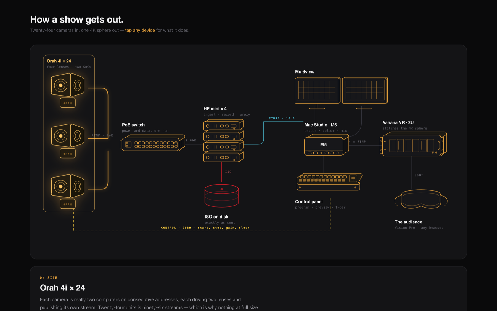
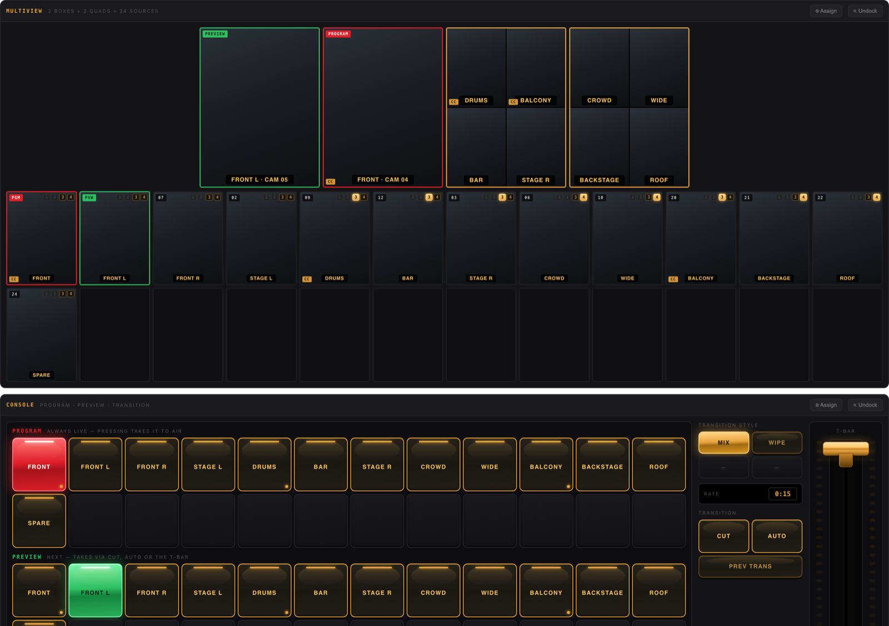
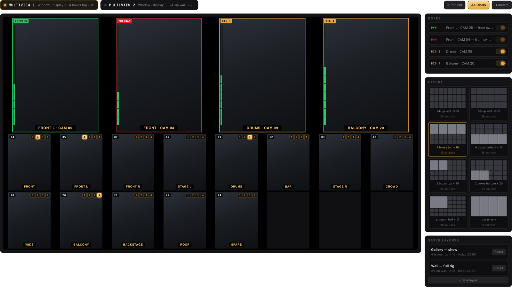
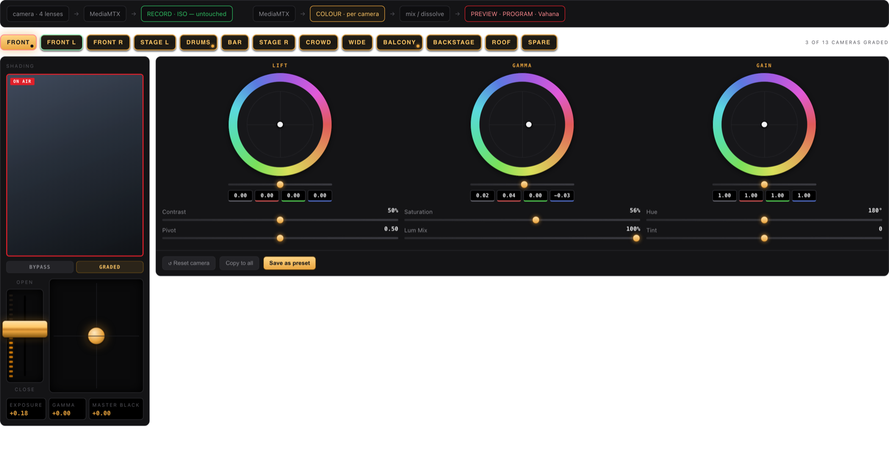
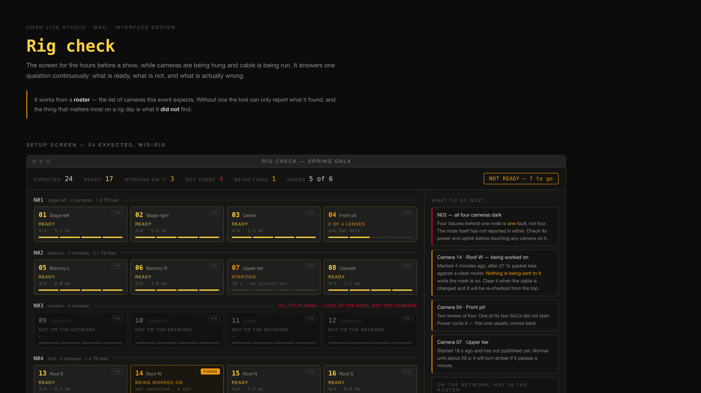
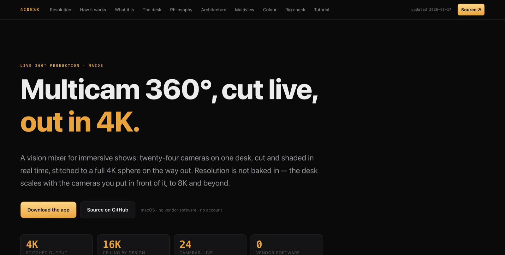

<div align="center">

# 4idesk

### Multicam 360°, cut live, out in 4K.

A vision mixer for immersive shows: twenty-four cameras on one desk, cut and
shaded in real time, stitched to a full 4K sphere on the way out.<br>
Resolution is not baked in — the desk scales with the cameras you put in front
of it, to 8K and beyond.

**[4idesk.com](https://4idesk.com)** ·
[Download the beta](https://github.com/peterridzon/camorah/releases/download/v1.0.0-beta/4idesk-1.0.0-beta.zip) ·
[Documentation](#documentation)

| 4K | 16K | 24 | 0 |
|:--:|:---:|:--:|:-:|
| stitched output | ceiling by design | cameras, live | vendor software |

</div>

> Every design on [4idesk.com](https://4idesk.com) is **live, not a
> screenshot** — click the buses, drag the T-bar, switch layouts. The same
> files are in [`docs/ux/`](docs/ux/); open any of them in a browser.



<div align="center"><sub>

Twenty-four cameras in, one 4K sphere out. The version on
**[4idesk.com](https://4idesk.com/signalflow.html)** is clickable — tap any
device for what it does and why it sits where it does.

</sub></div>

---

## The desk does not know what resolution it is running

Nothing in the signal path is written for a picture size. Nodes record by
**stream copy**, so they are indifferent by construction. The Mac decodes
exactly two cameras — programme and preview — and hands the same four lanes
onward in whatever shape they arrived. The sphere is assembled at the far end,
and it is the stitcher that decides how big it comes out.

| | | |
|---|---|---|
| **Today** — 4K sphere | Twenty-four Orah 4i, four lenses each at 1920×1440 | proven end to end |
| **Tomorrow** — 8K, 16K | Put larger sensors in front of it and the same desk carries them | the ceiling is the decoder and the stitcher, never the application |
| **Any camera** | Orah is what it was built against because that fleet exists and its maker does not | anything that publishes RTMP fits |

---

## The whole show, from the truss to the audience

[▶ Live and clickable](https://4idesk.com/signalflow.html) · [source](docs/web/signalflow.html)

The two paths that leave a node never meet again: one carries the show, the
other carries the recording, and nothing on the desk can reach the second one.

| Layer | Built with |
|---|---|
| Camera control | Hand-written protobuf over WebSocket, port 9989 |
| Discovery | Bonjour where it works, ARP by OUI where it does not |
| Transport | MediaMTX, config generated per run |
| Decode / encode | VideoToolbox, hardware both ways |
| Mix and colour | Metal, one pass |
| Recording | Node agent, stream copy |

---

## The camera outlived its company

The **Orah 4i** is a four-lens 360° camera. Each unit carries two SoCs on
consecutive addresses and publishes four RTMP streams at 1920×1440, which a
stitching box used to assemble into a 4K sphere. Orah is gone: the update
servers are dead, the boxes were unstable, and there is no way to buy a
replacement for either.

There is, however, a shelf of cameras that still work — so the software was
rebuilt around them, from the wire up, with no vendor library and nothing to
phone home to.

| | |
|---|---|
| **Finds them** | ARP sweep by Orah's own MAC prefix. Bonjour is multicast, and multicast from a wireless client to wired cameras is exactly what access points drop |
| **Keeps them** | Presence decided by the burned-in MAC, never by an open port — a recycled DHCP lease can never make one camera look like another |
| **Runs them** | CamAPI protobuf over WebSocket, implemented from the wire up and paced so the firmware survives it |

---

## The desk

[▶ Live and clickable](https://4idesk.com/#desk) · [source](docs/ux/switcher.html)

Twelve plus twelve keys on each bus, square and aligned, with the assignment
between button and camera done once at rig time. Program is always live;
preview is what CUT, AUTO or the T-bar takes next. Console and multiview are
two windows of one application — docked they share a frame, either undocks onto
its own display.



---

## Multiview

[▶ Live and clickable](https://4idesk.com/#multiview) · [source](docs/ux/multiview.html)

Two independent generators, one per screen. Twenty-four portrait cameras tile
properly at 8×3 on a 16:9 panel and nowhere else — which is why there are two
of them rather than one crowded one. Boxes 3 and 4 are quad splits; preview and
program stay whole.



---

## Colour, per camera, on the live path only

[▶ Live and clickable](https://4idesk.com/#colour) · [source](docs/ux/colour.html)

The cameras do not match each other, so correction is per unit and never
global. An exposure lever and a two-axis puck — gamma across, master black up
and down — carry most of the work, exactly as on a remote control panel.

None of it reaches the camera: the Orah protocol has no exposure or gamma
control, so all of it happens in the Metal pass. **The ISO recording never sees
any of it.**



---

## Rig check

[▶ Live and clickable](https://4idesk.com/#rig) · [source](docs/ux/rig-check.html)

Install day is a different job from show day. One question per camera: is it
there, is it talking, is it sending. **FIX** takes a unit out of the
conversation entirely while someone is recabling it; **INSTALL** binds whatever
is on the bench to a number without unplugging anything.



---

## Everything here was measured, not assumed

- **Only pictures prove anything.** The camera reports success the moment it
  accepts a command, long before a packet moves. Every state in this
  application is decided by streams arriving, never by a return code.
- **Never send what it cannot come back from.** This firmware can be wedged by
  talking to it too fast. Commands are paced, START is asked once, and a camera
  being worked on is left completely alone.
- **The recording is sacred.** Nodes record ISO by stream copy. Colour, mixing
  and effects ride the live path only — there is no setting that can
  contaminate the master.
- **Say which of the two problems it is.** "Camera is not there" and "camera is
  there but silent" send different people to different places. The interface
  never merges them.
- **One state, one place.** There used to be four sources for "is it working".
  They disagreed, and the desk showed a camera on air beside a button offering
  to start it.

---

## Getting started

```bash
brew install ffmpeg mediamtx      # the only two dependencies
cd OrahControl && ./build-app.sh  # builds the .app — no Xcode needed
open "build/4idesk.app"
```

There is nothing to configure. Power the cameras, open the app, and it finds
them.

```bash
orahctl discover           # what is on the network
orahctl checkout <host>    # survey one camera and archive its calibration
orahctl fleet              # rebuild the fleet sheet from the records
```

---

## From a box of cameras to a show

The same eight steps, with the interface beside them, are at
**[4idesk.com/#tutorial](https://4idesk.com/#tutorial)**.

1. **Power the cameras and open the app.** It sweeps the subnet by MAC prefix
   and adopts anything answering on 9989, announced or not.
2. **Run the rig check.** Each camera reads *not on the network*, *still
   booting*, *ready — press Start*, or a count of lenses arriving.
3. **Number them once.** **INSTALL** binds a serial to a position, and the
   number follows the hardware from then on.
4. **Press Start All.** About twenty seconds to all four lenses. A `START`
   answered `UNKNOWN_ERROR` means a SoC did not come up — pull that camera's
   power rather than trying again.
5. **Lay out the multiview**, send any source to a box with its amber keys, and
   undock it onto the second display.
6. **Match the cameras** in the colour corrector. The recording is unaffected.
7. **Assign the keys** left to right in the order they stand on site.
8. **Cut the show.** Programme leaves for Vahana; the nodes go on recording
   every camera clean, whatever happens on the desk.

---

## Status

A working beta. **Thirteen cameras proven end to end at four lenses each** —
the fleet survey, every fault and what fixed it are in
[`camera-records/FLEET.md`](camera-records/FLEET.md).

Not yet proven: the output consumed by Vahana, and the nodes on real hardware.
Both are architecture rather than guesswork, but neither has been run for real,
and this file will say so until it has.

---

## The website

[▶ 4idesk.com](https://4idesk.com) · [source](docs/web/) ·
[static build](site/) · [build script](tools/build-site.sh)

Plain static HTML with no build step and no external requests, so the same
folder opens from disk, uploads over FTP, or serves from Pages — and all three
are the thing that was actually reviewed. Every design on it is embedded live
rather than screenshotted, which means the page cannot drift away from the
application without it being visible.



---

## Documentation

| | |
|---|---|
| [`docs/MEASUREMENTS.md`](docs/MEASUREMENTS.md) | what the hardware actually does, measured. **The one worth reading** |
| [`docs/SPECIFICATION.md`](docs/SPECIFICATION.md) | what it is meant to do |
| [`docs/CALIBRATION.md`](docs/CALIBRATION.md) | the `.ptv` rig presets and what they mean |
| [`docs/FIRMWARE.md`](docs/FIRMWARE.md) | why a camera cannot be flashed from here |
| [`camera-records/FLEET.md`](camera-records/FLEET.md) | every unit, what it reported, what it did |
| [`camera-records/DEAD.md`](camera-records/DEAD.md) | the units that never reached the network |
| [`docs/ux/`](docs/ux/) | the designs: [desk](docs/ux/switcher.html) · [multiview](docs/ux/multiview.html) · [colour](docs/ux/colour.html) · [rig check](docs/ux/rig-check.html) |
| [`site/`](site/) | the website itself, plain static HTML you can copy anywhere |
| [`tools/build-site.sh`](tools/build-site.sh) | rebuilds `site/` from `docs/` |
| [`tools/deploy-site.sh`](tools/deploy-site.sh) | uploads it over FTPS — dry run by default |

Every rule this application follows is in `MEASUREMENTS.md`, with the camera
behaviour that forced it:

> **M8** — Eight STARTs in sixteen seconds put a camera into a state where even
> a file fetch that had just worked came back `UNKNOWN_ERROR`.

> **M10** — A START answered `UNKNOWN_ERROR` means at least one of the two SoCs
> did not bring up video. Retrying never once helped, and made one camera
> worse. It means pull the power, not try again.

---

## Firmware

The complete Orah firmware archive — every released version, the manuals, and
photographs of a disassembled unit — exists offline. It is about 3.8 GB and is
**deliberately not in this repository**; GitHub is not a backup. The file names
are listed in [`docs/FIRMWARE.md`](docs/FIRMWARE.md). If you need it, open an
issue.

It would not let you flash a camera anyway: the camera firmware is sealed
inside the signed stitching-box image, and the box is the only thing that can
write it.

---

<div align="center">

**[4idesk.com](https://4idesk.com)**

The original Camorah project this repository grew out of is preserved as
[`CAMORAH_ORIGINAL.md`](CAMORAH_ORIGINAL.md).

</div>
