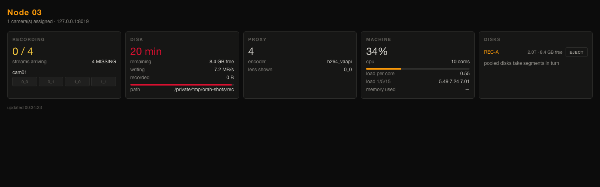
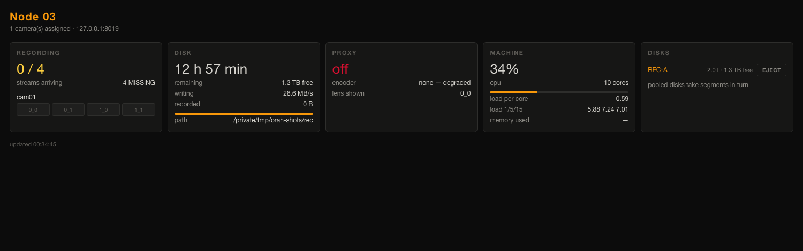

# Node interface

Generated by `tools/make-screenshots.py`. Re-run it after any UI change —
screenshots that are taken by hand stop matching the software.

## Everything running: four streams arriving, two disks pooled

## Disk running out — the number that decides whether to act

## No hardware encoder: still recording, but serving no proxy

## One lens not arriving — the failure a list would hide

